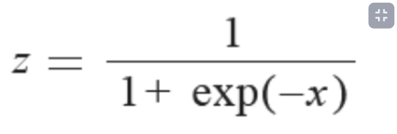
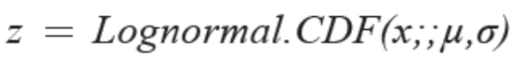
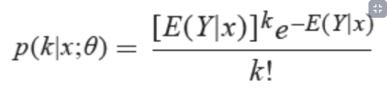

# Matematicas-para-Data-Science-Estadistica-Descriptiva

## Medidas de tendencia central

Son medidas que nos ayudan a resumir una gran cantidad de información en un solo numero

*   Media: Es el promedio de todos los datos, puede ser susceptible a valores atípicos
*   Mediana: es el dato central es decir tiene la misa cantidad de datos a su izquierda y derecha, no es lo mismo que la media
*   Moda: es el dato que mas se repite, la moda no aplica para datos numéricos continuos

### Diagrama de frecuencia
Es la representación grafica asociada a la tabla de frecuencia, normalmente todos los estadísticos descriptivos se pueden representar en términos de esta distribución

##Como dato curioso e interesante:
No solo existen esas 3 medidas de tendencias central, hay otras más poco conocidas, pero las abordaremos ahora mismo:

*   Media ponderada: es una medida de tendencia central, que es apropiada cuando en un conjunto de datos cada uno de ellos tiene una importancia relativa (o peso) respecto de los demás datos. Se obtiene multiplicando cada uno de los datos por su ponderación (peso) para luego sumarlos, obteniendo así una suma ponderada; después se divide esta entre la suma de los pesos, dando como resultado la media ponderada.
*   Media armónica: La media armónica es igual al número de elementos de un grupo de cifras entre la suma de los inversos de cada una de estas cifras.

En otras palabras, la media armónica es una medida estadística recíproca a la media aritmética, que es la suma de un conjunto de valores entre el número de observaciones.
Media geométrica: es una cantidad arbitraria de números (por decir n números) es la raíz n-ésima del producto de todos los números; es recomendada para datos de progresión geométrica, para promediar razones, interés compuesto y números índice.

## Diagramas de dispersión en el análisis de datos

[data viz project](https://datavizproject.com/)

## Transformación no lineal
¿Por qué usarlos?
En el caso donde haya datos fuertemente sesgados y no simétricos.
.

### Algunos tipos:

* **Logística**: los valores de la columna se transforman mediante la siguiente fórmula:

  

* **LogNormal**: esta opción convierte todos los valores a una escala logarítmica normal. Los valores1 de la columna se transforman mediante la siguiente fórmula:

  

Aquí μ y σ son los parámetros de la distribución, calculados empíricamente a partir de los datos como estimaciones de máxima verosimilitud, para cada columna por separado.

* **TanH**: todos los valores se convierten a una tangente hiperbólica. Los valores de la columna se transforman mediante la siguiente fórmula:

  

### ¿Cuándo usarlos?
Justo antes de aplicar el escalamiento lineal, las transformaciones no lineales solo son para que nuestros datos queden lineales para luego aplicar la normalización lineal. Siempre se debe aplicar la normalización lineal.

## Procesamiento de datos numéricos en Python

Links:
* [6.3. Preprocessing data](https://scikit-learn.org/stable/modules/preprocessing.html)
* [sklearn.datasets.load_diabetes](https://scikit-learn.org/stable/modules/generated/sklearn.datasets.load_diabetes.html)
* [Map data to a normal distribution](https://scikit-learn.org/stable/auto_examples/preprocessing/plot_map_data_to_normal.html)

## Pipelines de procesamiento para variables categóricas

Cuando se tiene **variables categóricas** se hace un mapeo numérico. Para eso hay 2 métodos, de manera que sean fácilmente interpretables en modelos de machine learning:

* **Dummy** : es la representación más compacta que se puede tener de los datos. Es mejor usarla cuando los inputs son variables linealmente independientes (no tienen un grado de correlación significativo). Es decir, las cuando se sabe que las categorías son independientes entre sí.
* **One-hot** : es más extenso. Permite incluir categorías que no estaban en el dataset inicialmente. De forma que si se filtra una categoría que no estaba incluida, igual se pueda representar numéricamente y no de error en el modelo (este modelo es más cool y es el que se usa).

Hay errores en la notación de Pandas y los tratan como que ambos modelos son lo mismo, pero en la realidad el Dummy no se usa. Aún así, en Pandas el método es .get_dummies().

## Procesamiento para variables categóricas con Python

Links:
* [pandas.get_dummies](https://pandas.pydata.org/docs/reference/api/pandas.get_dummies.html)
* [Encoding categorical features](https://scikit-learn.org/stable/modules/preprocessing.html#encoding-categorical-features)

## Matriz de covarianza

Una matriz de varianzas-covarianzas es una matriz cuadrada que contiene las varianzas y covarianzas asociadas con diferentes variables. Los elementos de la diagonal de la matriz contienen las varianzas de las variables, mientras que los elementos que se encuentran fuera de la diagonal contienen las covarianzas entre todos los pares posibles de variables.